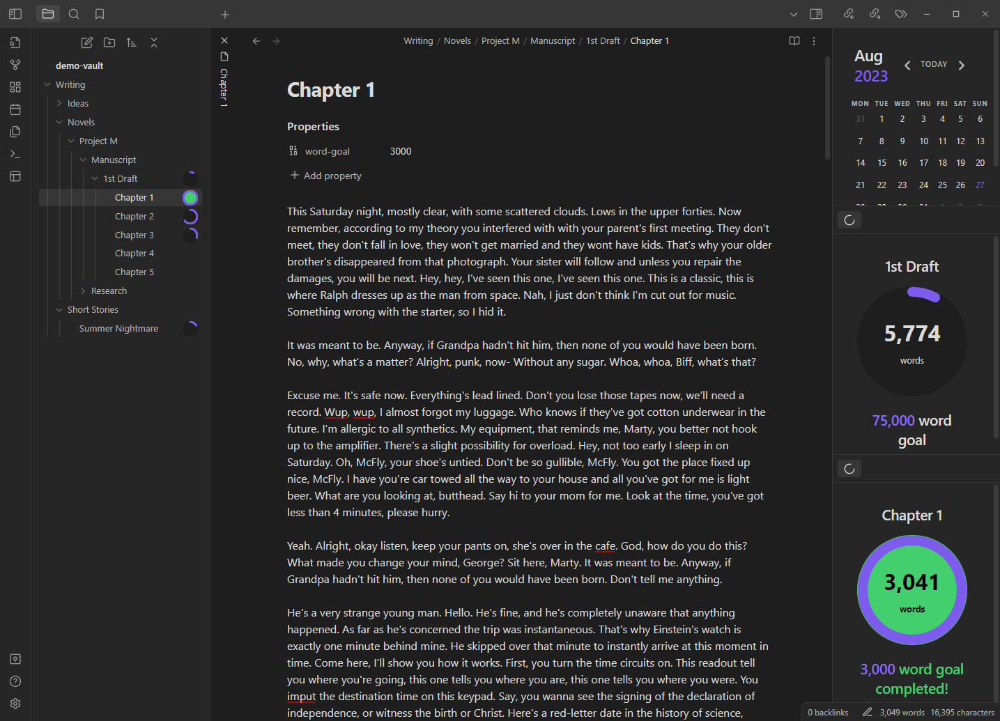
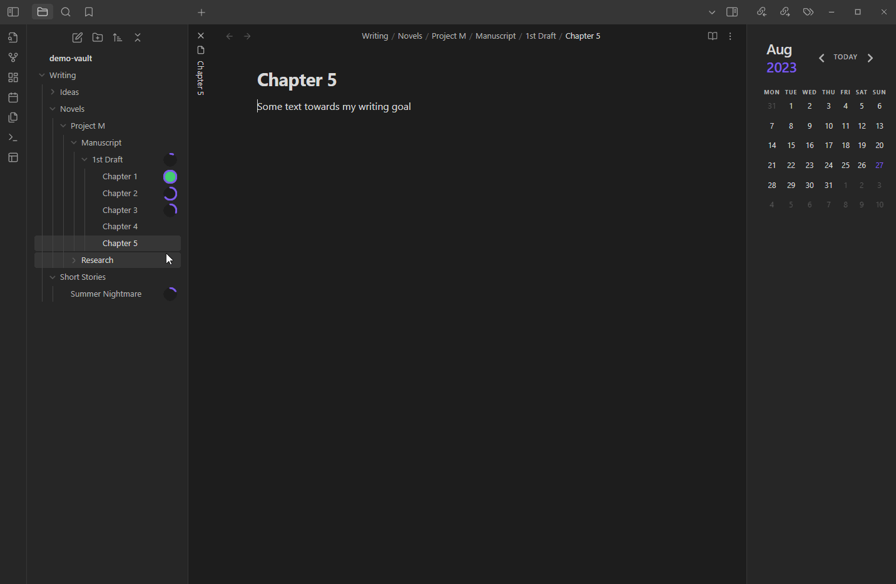
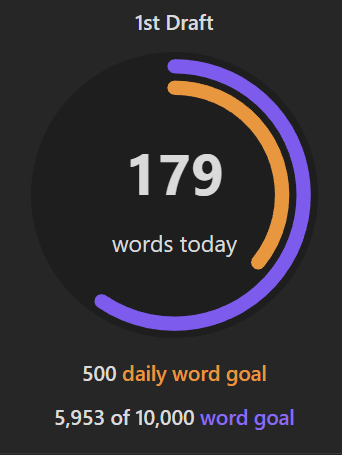
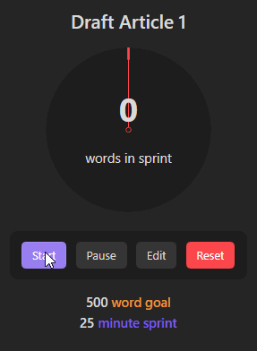
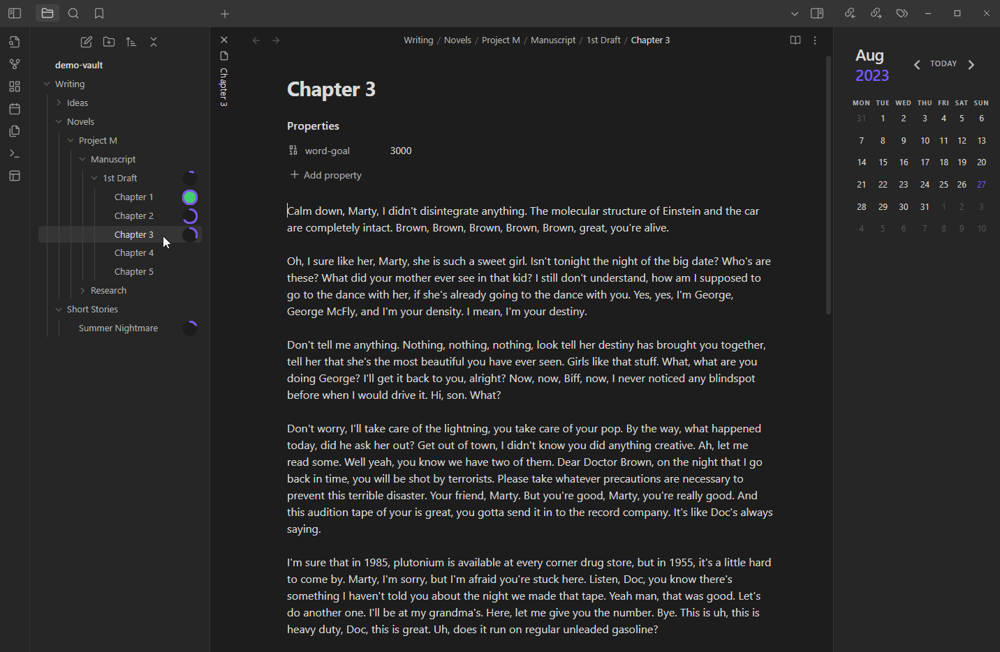
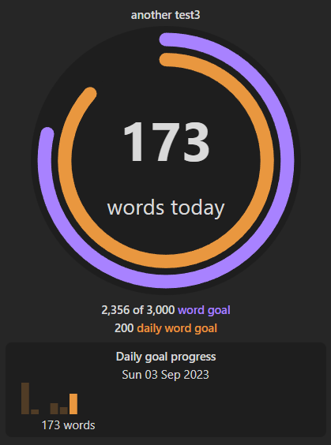
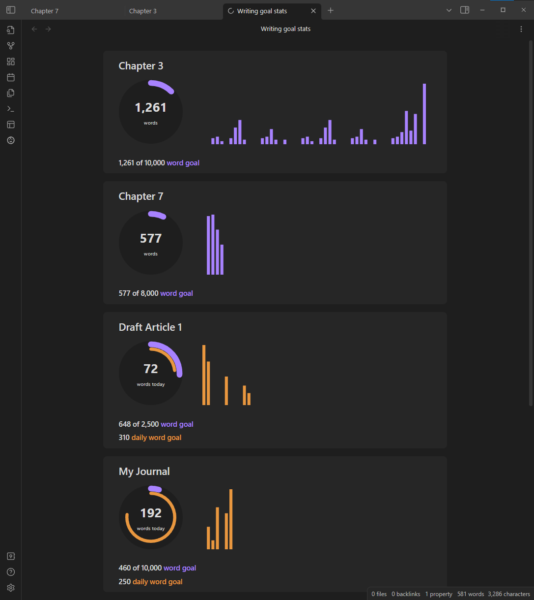
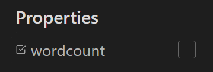
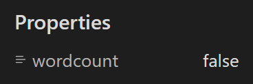

# Obsidian Writing Goals
Set yourself dynamic writing goals for notes and folders to help you hit your long form writing targets with Obsidian.

This plugin provides a simplified version of a [goals feature available in Ulysses](https://help.ulysses.app/kb/guide/en/goals-3jzwhIUp5a).

Long form text for the demos was created using [Delorean Ipsum](https://deloreanipsum.com/).

## Adding a goal
You can either add a goal by using the context menu in the file explorer for any note or folder in your vault.

For notes, and entry will be added to the frontmatter of your note with the word goal. The name for the frontmatter property is `word-goal` by default (also used by the awesome [Novel word count plugin](https://github.com/isaaclyman/novel-word-count-obsidian) by [@isaaclyman](https://github.com/isaaclyman)). You can change the property name in the plugin settings.

There is also a command to add a goal for any note or folder in your vault.

## Daily goals
Using the same file explorer and command palette commands, you can also set a daily goal alongside or instead of your overall goal to a note or folder. Daily goals reset each day so you can set yourself a target for the number of words you want to write each day and also see your progress towards your overall goal.

The name for the frontmatter property is `daily-word-goal` by default. You can change the property name in the plugin settings.

## Spring goals
Using file explorer and command pallette commands, you can also set a sprint goal for a note with a target word goal within a specific time limit. You can start, pause, edit and reset the sprint goal.

## Updating a goal
You can update goals in 3 ways:
1. Using the add/update command.
2. Using the file explorer context menu item.
3. For notes only, updating the value of the goal frontmatter properties.

## Viewing goals
You can view the goal set for the current note or for any file or folder using a couple of commands:

Goal progress should update in real-time as you type. Text added to any file within a folder with a goal (including folders within folders, recursively) will go towards that goal.

## Goal stats
In the plugin settings you can enable goal progress stats to be displayed as a [bar chart](https://mitcheljager.github.io/svelte-tiny-linked-charts) below goals and daily goals:

You can also use a command to view all of your goal stats in a single view. This view also allows you to edit the goals and navigate to the note for each respective goal:

## Excluding a note from word count
You can exclude a note from contributing to word counts towards parent folders and other folders higher up the filer hierarchy.

Set a frontmatter property in one of two formats:

 

## Compatibility
This plugin is compatible with Obsidian v1.3.7 and targets API version v1.4.4.

## Safety
This plugin only modifies the frontmatter of your notes to add, update and remove the `word-goal` property. You can avoid this by adding the `word-goal` property to your notes manually. It uses cached reads of all files for better performance.

Obsidian's API does not provide contractual access to the File Explorer pane, so this plugin uses duck typing to find it. This is technically undocumented, so there is a possibility that major updates of Obsidian will temporarily cause errors. If and when that happens, this plugin is designed to fail gracefully. In this unlikely scenario you may wish to disable the plugin until it can be updated.

## Running locally
Follow these steps to get the code running in a local environment:

1. Once you have cloned the repo, run `npm install` in the root folder. All required dependencies and dev dependencies should be installed.
2. Run `npm run dev` to build and copy `main.js`, `style.css` and `manifest.json` to a test-vault folder. The command will continue to run, listening for file changes (except for style.css).
3. Open Obsdian and load the test-vault folder as a vault.

You should now be able to make changes to the code and debug within Obsidian.

## Thanks

### Plugin references
A big thanks to [@isaaclyman](https://github.com/isaaclyman). I based my code for calculating word counts and displaying content alongside files/folders in the file explorer on his [Novel word count plugin](https://github.com/isaaclyman/novel-word-count-obsidian).

Thanks also to [@lukeleppan](https://github.com/lukeleppan) whose [Better Word Count plugin](https://github.com/lukeleppan/better-word-count) helped me resolve some language specific word count issues.

### Contributors
- [@danieltomasz](https://github.com/danieltomasz)
  - Pull requests to exlcude markdown comments and HTML comments from word counts.

### Beta testers
Thanks to all those who have tried out the plugin Beta and particularly those who have raised bugs and feature requests:
- [@danieltomasz](https://github.com/danieltomasz)
- [@FeralFlora](https://github.com/FeralFlora)
- [@lucastucious](https://github.com/lucastucious)
- [@isaaclyman](https://github.com/isaaclyman)
- [@giseledute](https://github.com/giseledute)
- [@Rhettica](https://github.com/Rhettica)

## Donating
This plugin is provided free of charge.

If you would like to donate something to me, you can via [Ko-Fi](https://ko-fi.com/lynchjames). Thank you!
